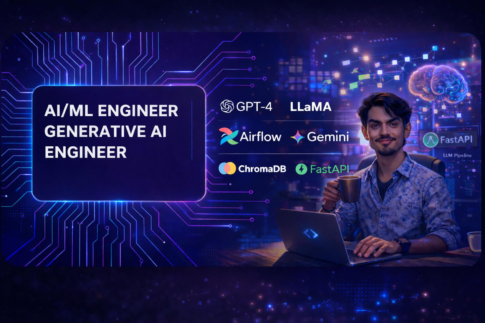

  

<h1 align="center">Hi, I'm Ramith 👋</h1>
<h3 align="center">AI / ML Engineer · Generative AI · RAG Systems · LLM Applications</h3>

  
  

---

## 🚀 About Me

I'm an **AI/ML Engineer** specializing in **Generative AI** and **production-grade RAG (Retrieval-Augmented Generation) systems**. I build intelligent, LLM-powered applications from the ground up — from vector search pipelines and hybrid retrieval strategies to secure, scalable backend architectures.

- 🔭 Currently building **Lucivox Studio** — a full-stack RAG platform with Hybrid Search, Cross-Encoder reranking, Semantic Chunking, and Conversation-Aware Retrieval
- 🤖 Deep experience with **Ollama, LangChain, LangGraph, ChromaDB, FastAPI, and Next.js**
- 🧠 Passionate about **RAG architecture, Agentic AI systems, Prompt Engineering, and LLM fine-tuning**
- 🎯 Focused on building AI products that are **accurate, fast, and production-ready**
- 📫 Reach me at: **ramithn27@gmail.com**

---

## 🛠️ Tech Stack

**AI / ML**

**Backend**

**DevOps & Tools**

---

## 🧩 Featured Projects

### 🎙️ [Lucivox Studio — Voice of Light](https://github.com/RamithN2002/LucivoxStudio-VoiceOfLight)
> *Production-grade RAG Application | FastAPI · Next.js · ChromaDB · Ollama*

A full-stack RAG platform built from scratch with advanced retrieval techniques that go far beyond basic vector search.

**Key Features:**
- 🔍 **Hybrid Search** — Vector + BM25 + Query Expansion fused with RRF (Reciprocal Rank Fusion)
- 🎯 **Selective Cross-Encoder Reranking** — precision reranking on top retrieval candidates
- ✂️ **Semantic Chunking** — intelligent document splitting based on meaning, not just token count
- 🧠 **Conversation-Aware Retrieval** — query rewriting + retrieval memory across chat turns
- 📌 **Contextual Chunk Headers** — every chunk carries document-level context
- ✅ **Answer Grounding Check** — validates LLM responses against retrieved sources
- 🔐 **JWT Auth + Per-User Document Isolation** — secure multi-user architecture

---

### 👨‍🌾 [AIMS — Agriculture Information Management System](https://github.com/RamithN2002/DBMSproject)
> *Java Swing · MySQL · DBMS*

A Java Swing desktop application enabling online access to agricultural information for 50+ users, with full CRUD operations powered by MySQL.

---

### 💊 [Pill Reminder](https://github.com/RamithN2002/PILLREMINDER-MAD)
> *Android · Java · Firebase*

An Android medication reminder app with Firebase integration, delivering 50+ timely notifications to improve medication adherence.

---

## 📊 GitHub Stats

  

  

  

--

  <i>"Models predict. I build what generates."</i>

